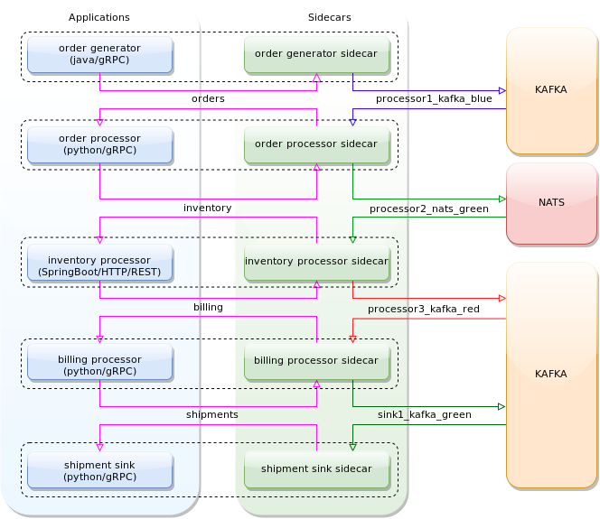
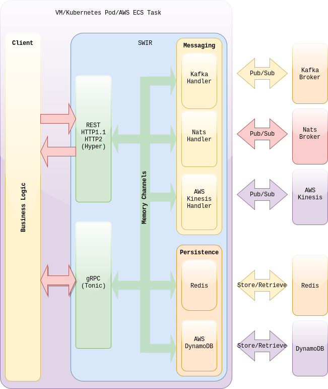

# SWIR or Sidecar Written in Rust

For alternative meaning of [SWIR](https://en.pons.com/translate/polish-english/swir)

## Rationale

In an enterprise world where many teams are using different technology stacks, the introduction of sidecar could offer an avenue to provide a uniform set of capabilities to all applications irrespective of which language their ware implemented.
Sidecar approach provides a necessary abstraction layer that protects the application teams from the underlying infrastructure.
The applications implementing business logic stay relatively simple, and the sidecar takes on responsibility for providing consistent and the most optimal way to utilise available resources.
This approach can produce better division of responsibilities and thus better organisational alignment of teams, particularly in the large enterprise environment. Application teams can focus on delivering business requirements. The infrastructure support teams can focus on providing the necessary rails on which the application can run.  

The rationale of this point could be explained better with a simple stakeholder analysis.

- **Application teams** - Many application teams can solely focus on business logic and worry less about dependency management and infrastructure on which the application is running. Since a sidecar is a separate process, the main application becomes more streamlined as most of the dependencies are part of a sidecar. Application owners don't need to worry about how to communicate with other parts of the solutions since the sidecar provides the necessary functionality. The fact that the sidecar sits between the business logic and the infrastructure means that the business flows in the entire solution could potentially be tested with relative ease on a developer's laptop with sidecar taking responsibility for mocking the production environment. As enterprise solutions grow in size and complexity, commonalities emerge which are prime candidates for offloading to a sidecar. Moving boilerplate code to the sidecar ensures that the necessary implementation is done in one place and in the best possible way.  Since all components of the solution rely on a sidecar, automatically these components have access to the same functionality.

- **Infrastructure teams** - With a sidecar approach, the infrastructure team can safely transition the whole enterprise to the next best thing without forcing the application teams to re-design or re-build their business logic. Applications implementing business logic are unaffected by a potential transition from one type of broker to a different kind of broker or perhaps ditching brokers altogether in favour of client-side load balancing with gRPC.  The abstraction layer provided by a sidecar enables application teams to express solution topology in infrastructure-independent terms which then could be translated into concepts specific to the infrastructure in a given environment. The additional separation between business logic and configuration should enable smoother and less complex deployments.       

- **Operations and support teams** - The solutions built from sidecar enabled applications could achieve consistency at the enterprise level when it comes to logging in monitoring since all sidecars would adhere to the same logging principles. A sidecar could easily inject information needed to trace requests as they traverse the solution. One could envisage, the operations teams building the whole solution with some mock or rudimentary business logic to ensure that all blocks are wired together correctly. In this sense, the sidecar approach allows application, infrastructure and operation teams to move at different speeds without impacting each other's schedule. The teams can move quicker with testing, and the application and infrastructure can initially be tested in splendid isolation since sidecar makes the hard interdependencies less impacting.

- **Corporate security teams** - From the security teams perspective, the sidecar approach should be particularly appealing. Instead of having to vet many different technology stacks with many different ways of securing network connectivity or encrypting data, only a sidecar needs to be thoroughly vetted. Adherence to security principles could be governed and enforced at the enterprise level through changes to the sidecar and without impacting the schedule or functionality of the business logic. Common but complex things such as the use of encryption could be accessible to applications written in different technology stacks through a simple API call to a sidecar. In a braver scenario, a specialised sidecar could encrypt all highly sensitive fields before being written to persistent storage. Again simplifying the life for the application and security teams and helping the enterprise building a better and more secure solution.

## Usecases

### PubSub
The example presented in [docker/solution-example](docker/solution-example) shows how applications using completely different technology stacks can talk to each other seamlessly using SWIR sidecars. As shown in the diagram below, we have python/gRPC, java/Springboot and java/gRPC business logic communicating with each other over Kafka/Nats brokers.  
The use case is broken into two layers:

-  The infrastructure team sets up a network of SWIR sidecars ([docker/solution-example/docker-compose-example-sidecars.yaml](docker/solution-example/docker-compose-example-sidecars.yaml)).

-  The applications are deployed and communicate with each other via SWIR sidecars ([docker/solution-example/docker-compose-example-applications.yaml](docker/solution-example/docker-compose-example-applications.yaml)). 

The real power of sidecars can be appreciated when we consider migrating this example to a public cloud. Figure below shows how to migrate this example into AWS. Despite having to use a completely different technology stack, SWIR allows applications to migrate to a new environment without having to rebuild the artefacts. Here the applications are deployed into AWS Elastic Container Service and using AWS Kinesis instead of Nats and Kafka to communicate with each other. 

### State
SWIR can abstract your application logic from the nitty-gritty details of how and where the data is stored. SWIR presents a consistent interface and will smooth subtle differences between the engines. Example solutions described above show how SWIR can be used to store data in Redis or Amazon DynamoDB. 

### Service Discovery and Invocation 
Service Discovery and Invocation and yet another use case where sidecars can show their value. Here SWIR sidecars create a service mesh and provide capabilities to advertise, discover and make API calls to services behind them. In service discovery and invocation mode, SWIR serves as an abstraction layer which handles connectivity, authentication, authorisation on behalf of the application's business logic. The figure below shows the general concept where SWIR uses mDNS for advertising and discovering services. Unfortunately, mDNS does not work in AWS, so we provided a simple resolver based on AWS DynamoDB. This resolver is super straightforward and not production-ready, but it should not take much to connect it to Consul or other well-known service registries. 

For more details have a look at the examples provided in [docker/solution-example-service-invocation](docker/solution-example-service-invocation) and [docker/solution-example-aws-service-invocation](docker/solution-example-aws-service-invocation).

## Top Level Architecture

## Rust
Rust is a safe language, and side by side benchmarks show that the applications which are written in Rust achieve performance comparable with applications written in C or C++. In choosing an implementation language for a sidecar, these two factors are probably the most important. Rust language secure design guarantees that an attacker can't compromise the sidecar due to problems with memory safety. At the same time, since sidecar is responsible for most of the application's system-level functionality, it is crucial to minimise sidecar's impact on the performance. As Rust has no runtime nor garbage collector, it can run very fast and with small latency.

## About Swir
This project is just a starting point to a conversation about sidecars, particularly for solutions consisting of many event-driven components. Even then it has some interesting features mainly because of the quality of crates created and maintained by Rust community:
SWIR:
 - has moved to asynchronous programming
 - uses [Hyper](https://hyper.rs/) to expose REST interfaces over HTTP or HTTPS  
 - uses [Tonic](https://docs.rs/tonic/0.1.1/tonic/index.html) to handle gRPC calls  
 - uses [rdkafka](https://github.com/fede1024/rust-rdkafka) to talk to [Kafka](https://kafka.apache.org/) brokers  
 - uses [Nats](https://github.com/jedisct1/rust-nats) to talk to [NATS](https://nats.io) brokers  
 - uses [rusoto](https://github.com/rusoto/rusoto) AWS SDK for Rust   
 - uses [redis-rs](https://github.com/mitsuhiko/redis-rs) Redis SDK for Rust  
 - is using modified [config-rs](https://github.com/swir-rs/config-rs) so various aspects can be configured via a yaml file and environment variables can be easily injected based on an   environment  
 - adapted and improved mDNS(https://github.com/swir-rs/rust-mdns) to advertise/resolve services  
 - SWIR uses conditional compilation which allows creating sidecars with just Kafka or Kafka and NATS  
 - HTTP and gRPC Java and Python clients and other components allowing testing it end to end  
 - SWIR can start the client application (for time being only SpringBoot standalone jars)  
   
## Short Term Roadmap
- encryption offloading  
- maybe Cassandra facade  
- logging and monitoring__
- better security, TLS everywhere and proper authentication and authorisation

# Requirements
- Docker and Docker Compose to build and run the infrastructure, and the examples. 
- Also you will need Java 1.8 or higher and Gradle to build example applications.

# Running
Check examples provided in [performance framework](docker/performance-framework), [messaging](docker/solution-example) and [service invocation](solution-example-service-invocation) to see how to run Swir in Docker Compose environments.  

If you are interested in seeing Swir working in AWS ECS, check examples provided in [messaging in AWS](docker/solution-example-aws) and [service invocation in AWS](docker/solution-example-aws-service-invocation).  

### Similar Frameworks

SWIR has been influenced by Microsoft's [Distributed Application Runtime - Dapr](https://github.com/dapr/dapr). It is hard to compete with Microsoft's unlimited resources, but someday perhaps SWIR might achieve a parity :)

