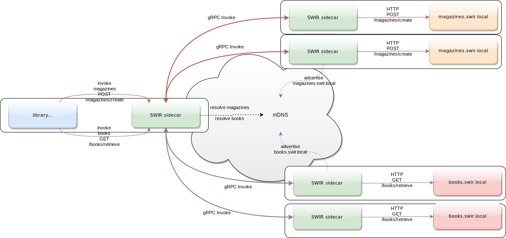

### In this exmaple SWIR sidecars are used to :

 * Invoke REST services exposed by other applications
 * Create a zero config service mesh where services are discoverable through cusom DynamoDB based Service Registry since mDNS doesn't work in ECS :( 
 * Protect the integrity of traffic in the mesh with mTLS


### Service Discovery and Invocation


### Running this example:

```./run_example.sh amazonID region```

you need to export your AWS credentials as environment variables in ../../../secure.sh as shown below

```
export AWS_ACCESS_KEY=Swir  
export AWS_SECURE_ACCESS_KEY=Swir
```

### Cleaning up resources:

```./cleanup_example.sh clusterID``` 

where clusterID is printed when the ECS cluster is created
