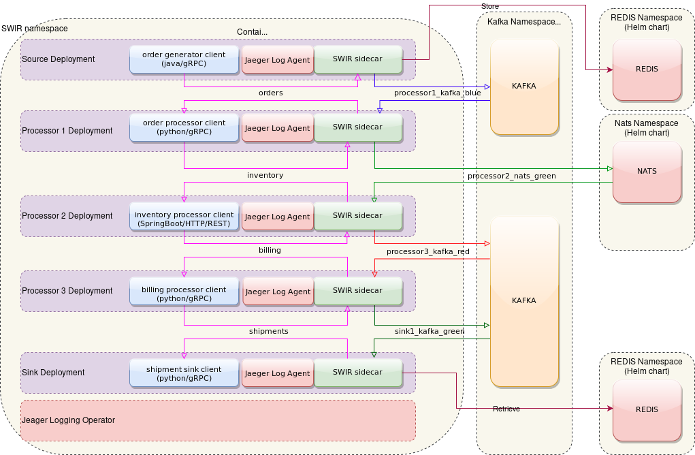

### In this exmaple SWIR sidecars are used to :

 * Store data in Redis
 * Send and receive messages to/from Kafka and Nats brokers.
 * Trace the flow of messages and send it to Jaeger UI

### PubSub and Store Example in Kubernetes


### Running this example :

```./run_example.sh pubsub-example swir-operator-ns```

#### it will take a while for a solution to stabilize

### Get URL for tracing dashboard

```../tracing_dashboard.sh pubsub-example```

### To check logs run : 

```./display_source_logs.sh pubsub-example ```

```./display_sink_logs.sh pubsub-example ```


### Cleaning up resources:

```./cleanup_example.sh pubsub-example swir-operator-ns```
